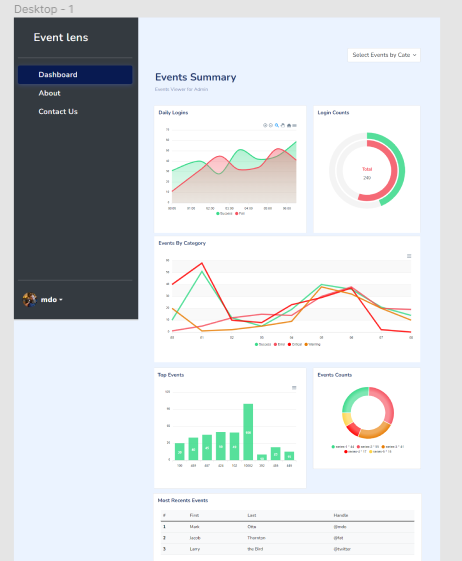

# Log Analytics Project

## Overview

This project revolves around the analysis of log data generated by various components within our system. By harnessing the power of log analytics, we can to transform raw data into actionable insights, empowering administrator to make informed decisions, enhance system reliability, and ensure a early fault detection and action.

## Features

List the key features and functionalities of your log analytics setup.

- Admin Authentication
- Real-time Dashboards and Visualizations
- Optional: Machine Learning Integration

## Getting Started
### prototype
- Dashboard

- Login page

### Prerequisites

### Installation